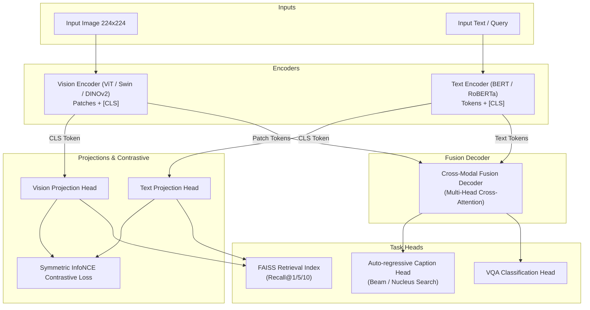

# Multi-Modal Vision Transformer for Image-Text Understanding

[](https://www.python.org/downloads/release/python-3110/)
[](https://pytorch.org/)
[](https://huggingface.co/transformers/)
[](https://gradio.app/)
[](LICENSE)

A production-grade, modular deep learning framework combining **Vision Transformers (ViT)** and **Transformer Language Encoders** with **Cross-Attention Fusion** for joint image-text representation learning. 

This repository supports multi-task downstream execution including **Image Captioning** (Greedy, Beam Search, Top-k, Top-p), **Visual Question Answering (VQA)**, **Cross-Modal Similarity Search** (FAISS vector retrieval), and **Cross-Attention Heatmap Explainability**.

---

## 📐 Architecture Overview

The system unifies visual feature extraction and textual representation learning into a shared multimodal latent space.



---

## ✨ Key Features

- **Flexible Backbones**: Switch between `ViT-B/16`, `ViT-L/16`, `Swin Transformer`, `DINOv2`, `BERT`, `RoBERTa`, and `DistilBERT` via YAML configuration.
- **Joint Multi-Task Learning**:
  - **Image-Text Contrastive (ITC) Loss**: infoNCE alignment with learnable temperature scaling.
  - **Image Captioning**: Autoregressive next-token prediction supporting **Beam Search**, **Top-K**, **Top-P (Nucleus)**, and **Greedy** decoding.
  - **Visual Question Answering (VQA)**: Fusion classification over candidate answer vocabularies.
  - **Cross-Modal Retrieval**: Sub-millisecond vector indexing using **FAISS**.
- **Production Training Pipeline**: Automatic Mixed Precision (AMP), gradient accumulation, cosine annealing with warmup, TensorBoard, Weights & Biases (`wandb`), and best model checkpointing.
- **Synthetic Data Fallback**: Instant out-of-the-box execution without downloading multi-gigabyte datasets.
- **Explainability**: Interactive cross-attention heatmap visualizations and t-SNE joint embedding space plots.
- **Model Deployment**: Export utilities for **ONNX** and **TorchScript** acceleration.
- **Interactive UI & Containerization**: Full-featured **Gradio** web app and multi-stage **Dockerfile**.

---

## 📁 Repository Structure

```
multimodal-vit/
├── configs/
│   ├── model.yaml             # Model backbones, hidden dimensions, heads config
│   └── train.yaml             # Training hyperparameters, optimizer, losses, device
├── datasets/
│   ├── coco.py                # MS COCO Captions Dataset loader + synth fallback
│   ├── flickr30k.py           # Flickr30K Dataset loader + synth fallback
│   ├── vqa.py                 # VQAv2 Dataset loader + synth fallback
│   └── multimodal_dataset.py   # Unified PyTorch dataset collator & factory
├── models/
│   ├── vision_encoder.py      # ViT / Swin / DINOv2 / OpenCLIP vision encoder
│   ├── text_encoder.py        # BERT / RoBERTa / DistilBERT text encoder
│   ├── cross_attention.py     # Multi-Head Cross-Attention Decoder Blocks
│   └── multimodal_model.py    # Unified MultiModalViT model architecture
├── losses/
│   ├── contrastive_loss.py    # InfoNCE and Triplet Margin alignment loss
│   └── caption_loss.py        # Label-smoothed CrossEntropy and Multi-Task loss
├── trainers/
│   └── trainer.py             # PyTorch / AMP Trainer with logging & checkpointing
├── utils/
│   ├── tokenizer.py           # HuggingFace & custom tokenizer wrapper
│   ├── metrics.py             # BLEU-1..4, ROUGE-L, CIDEr, VQA Acc, Recall@K, MRR
│   └── visualization.py       # Loss curves, t-SNE, Attention Heatmaps
├── inference/
│   ├── caption.py             # Beam search, Top-k, Top-p image captioner
│   ├── vqa.py                 # VQA question answering engine
│   └── retrieval.py           # FAISS-backed Image-Text vector retrieval index
├── app/
│   └── gradio_app.py          # Interactive Gradio Web Demo (4 Tabs)
├── tests/
│   ├── test_models.py         # Unit tests for model forward passes
│   ├── test_losses.py         # Unit tests for loss calculations
│   ├── test_metrics.py        # Unit tests for evaluation metrics
│   └── test_inference.py      # Unit tests for inference pipelines
├── notebooks/
│   └── demo.ipynb             # End-to-End tutorial Jupyter notebook
├── export.py                  # ONNX & TorchScript exporter
├── train.py                   # Main CLI training script
├── evaluate.py                # Main CLI evaluation script
├── requirements.txt           # Python dependencies
├── Dockerfile                 # Multi-stage production container build
├── .github/workflows/ci.yml   # GitHub Actions CI workflow
└── README.md                  # Detailed documentation
```

---

## ⚡ Quickstart

### 1. Installation

```bash
# Clone repository
git clone https://github.com/your-username/multimodal-vit.git
cd multimodal-vit

# Install dependencies
pip install -r requirements.txt
```

### 2. Run PyTest Unit Tests

Verify everything works cleanly:

```bash
pytest tests/ -v
```

### 3. Launch Training (Synthetic Fast Mode)

```bash
python train.py --config configs/train.yaml --synthetic
```

To train on real MS COCO / Flickr30k data:

```bash
python train.py --config configs/train.yaml --dataset coco --epochs 20 --batch_size 32
```

### 4. Launch Interactive Gradio Web App

```bash
python app/gradio_app.py
```

Open `http://localhost:7860` in your web browser.

---

## 📊 Evaluation & Metrics

Execute evaluation on test or validation splits:

```bash
python evaluate.py --train_config configs/train.yaml --synthetic
```

Supported evaluation metrics:
- **Image Captioning**: BLEU-1, BLEU-2, BLEU-3, BLEU-4, ROUGE-L, CIDEr
- **Cross-Modal Retrieval**: Recall@1, Recall@5, Recall@10, Mean Reciprocal Rank (MRR)
- **Visual Question Answering**: Top-1 Accuracy, Confidence Score
- **Embedding Quality**: Cosine Similarity, Alignment Score

---

## 🛠️ Model Export (ONNX & TorchScript)

Export the trained Vision & Text encoders for production serving:

```bash
python export.py --output_dir ./outputs/exported_models
```

---

## 🐳 Docker Support

Build and launch the Docker container:

```bash
docker build -t multimodal-vit:latest .
docker run -p 7860:7860 multimodal-vit:latest
```

---

## 📜 References

1. Dosovitskiy et al., *An Image is Worth 16x16 Words: Transformers for Image Recognition at Scale*, ICLR 2021.
2. Radford et al., *Learning Transferable Visual Models From Natural Language Supervision (CLIP)*, ICML 2021.
3. Li et al., *BLIP: Bootstrapping Language-Image Pre-training for Unified Vision-Language Understanding and Generation*, ICML 2022.
